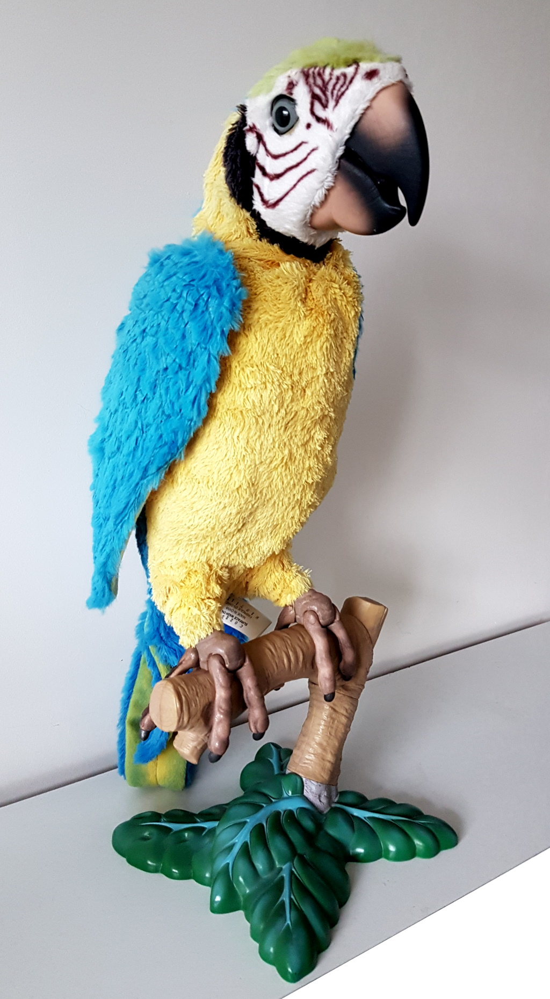
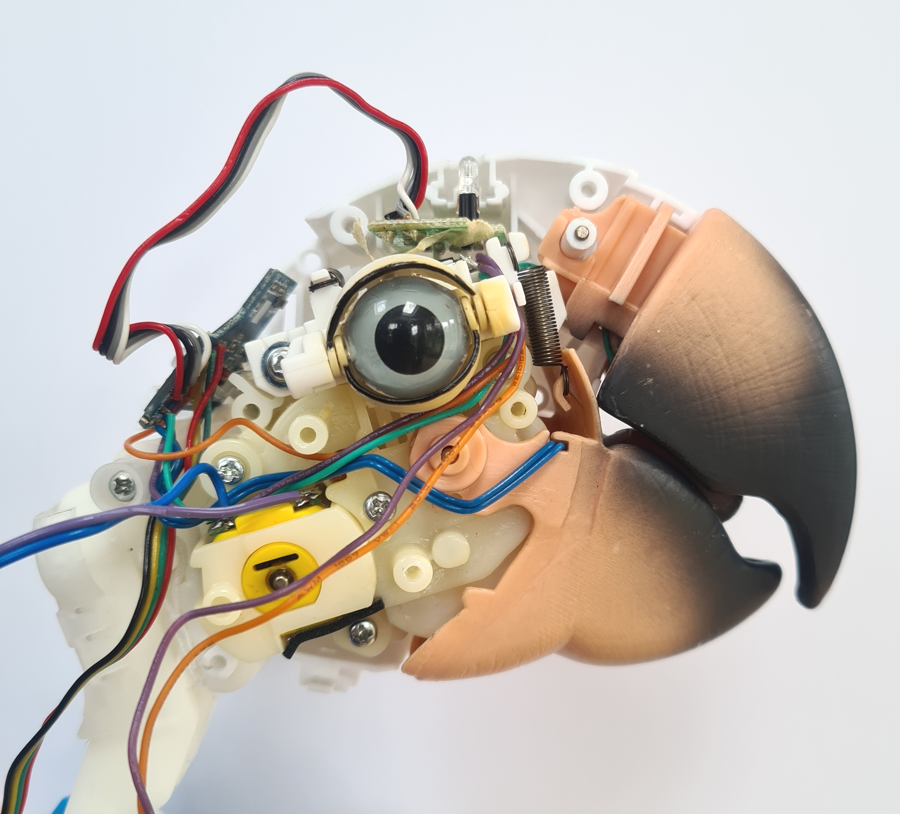
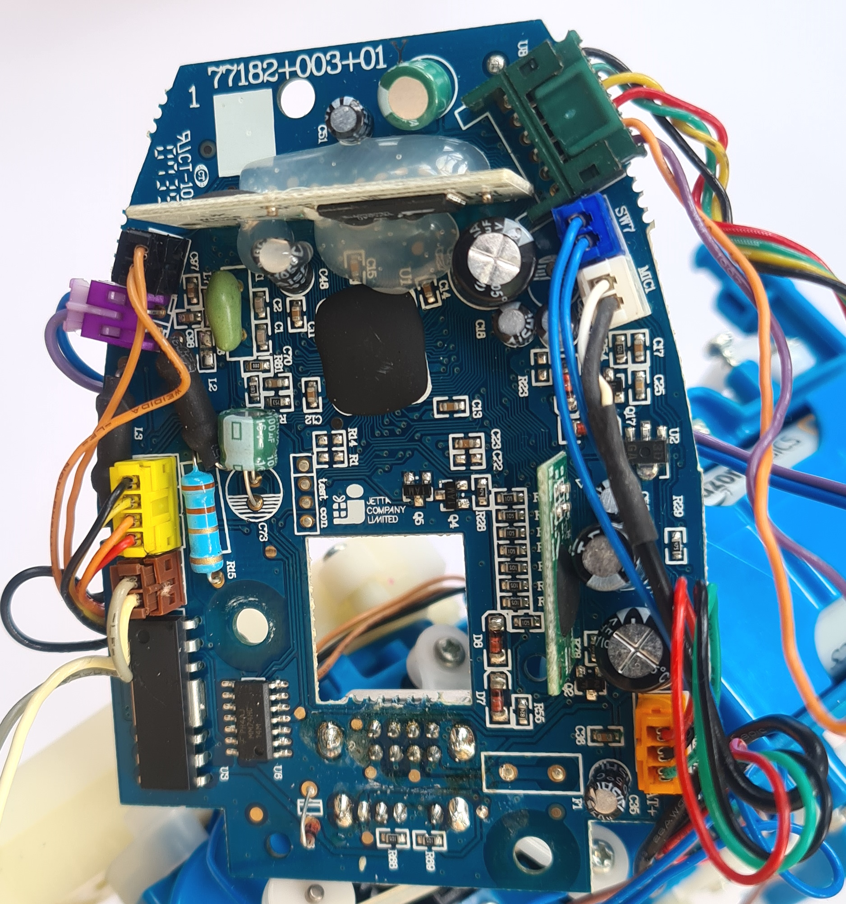
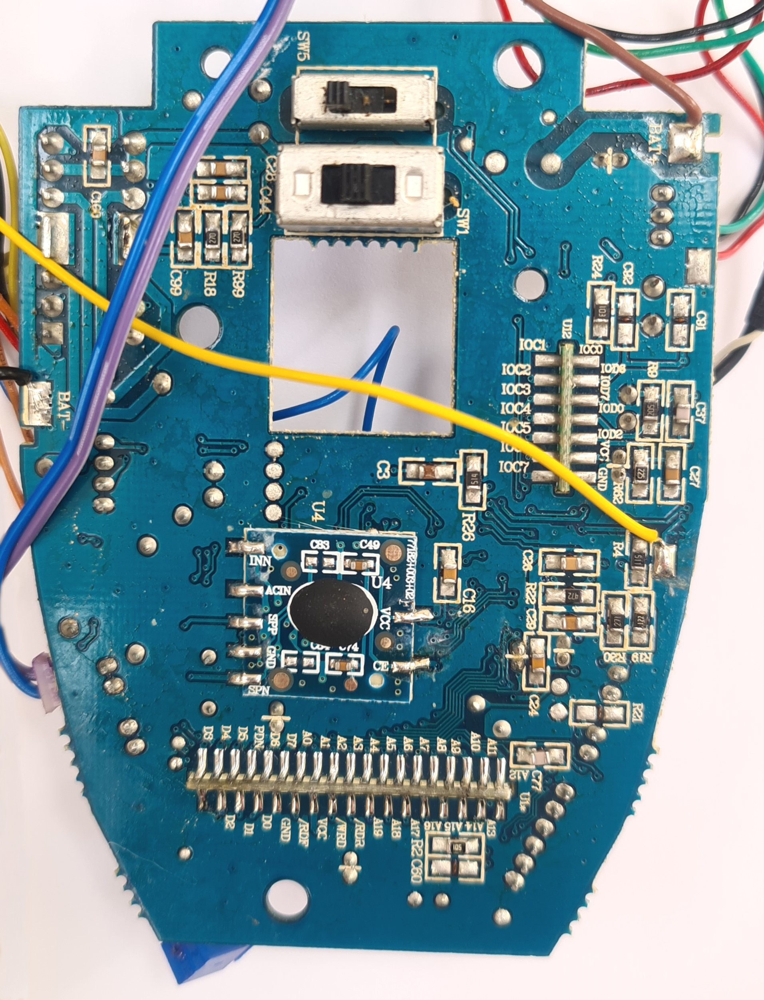
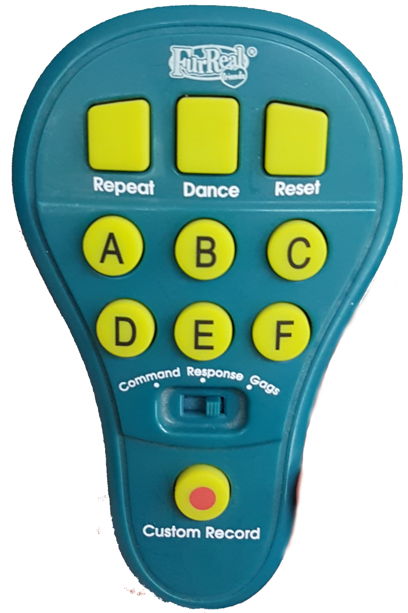

# SquawkersMcGraw
Reverse engineering and remixing the Hasbro FurReal Friend "Squawkers McGraw" animatronic parrot



## Internals
<table>
<tr>
<td></td>
<td></td>
<td></td>
</tr>
</table>
The main control board in mounted in the middle of the parrot's back, with wires to the separate components located around the body as follows:

### Inputs
There are a variety of switches and sensor inputs, as follows:

- Light sensor), connected via Red, Black, Grey, White wires to a seperate control daughterboard located at the base of the head.
- Tongue switch (head), connected via 2x Blue wires (one ground).
- Eyelid limit switches - one is pressed when eyes are fully-open (2x Orange wires, one is ground), and one switch pressed when they are fully-closed (2x Purple wires, one is ground). When neither switch is pressed, eyes are in the neutral position.
- Leg switch, located on the left leg, is pressed at certain positions during the parrot's body movement. 

### Outputs
All the movements are controlled via only two DC hobby motors. By using a clever CAM system, reversing the direction of the motors can trigger different actuators. 
- Eyelid and mouth movement are both controlled from the one motor located in the head, connected via slightly thicker Blue and Purple wires.
- Wings and fully body tilt are controlled from a second motor, located at the hips, connected via White and Grey wire.

## Infrared Controller


The controller has a three position switch, three play mode buttons, 6 program buttons, and a custom record button. It appears to broadcast command strings using the common 38kHz carrier frequency. For a non-destructive method of controlling Squawkers McGraw, you can simply transmit these same command codes to trigger any of the built-in behaviours.

The following command strings were grabbed using an Arduino and the InfraRed signal analyser code described at https://www.patreon.com/posts/infrared-puzzle-28343366

### Response Mode
```
// Repeat Button
unsigned int repeatData[17] = {3000,3000,1000,2000,1000,2000,1000,2000,1000,2000,2000,1000,1000,2000,2000,1000,1000};

// Dance (same in every mode)
unsigned int danceData[17] = {3000,3000,1000,2000,2000,1000,1000,2000,2000,1000,2000,1000,1000,2000,2000,1000,1000};

// Reset (same in every mode)
unsigned int resetData[17] = {3000,3000,1000,2000,2000,1000,2000,1000,1000,2000,1000,2000,2000,1000,1000,2000,1000};

// Buttons
unsigned int aData[17] = {3000,3000,1000,2000,1000,2000,1000,2000,1000,2000,2000,1000,1000,2000,2000,1000,1000};
unsigned int bData[17] = {3000,3000,1000,2000,1000,2000,1000,2000,2000,1000,1000,2000,2000,1000,1000,2000,1000};
unsigned int cData[17] = {3000,3000,1000,2000,1000,2000,1000,2000,2000,1000,2000,1000,2000,1000,2000,1000,1000};
unsigned int dData[17] = {3000,3000,1000,2000,1000,2000,2000,1000,1000,2000,2000,1000,1000,2000,1000,2000,1000};
unsigned int eData[17] = {3000,3000,1000,2000,1000,2000,2000,1000,2000,1000,1000,2000,1000,2000,2000,1000,1000};
unsigned int fData[17] = {3000,3000,1000,2000,1000,2000,2000,1000,2000,1000,2000,1000,2000,1000,1000,2000,1000};

// Custom Record
unsigned int customRecordData[17] = {3000,3000,1000,2000,2000,1000,2000,1000,1000,2000,2000,1000,2000,1000,2000,1000,1000};
```
### Command Mode
```
// Repeat Button (same for Command and Gags)
unsigned int repeatData[17] = {3000,3000,1000,2000,2000,1000,1000,2000,1000,2000,1000,2000,2000,1000,2000,1000,1000};

// Dance (same in every mode)
unsigned int danceData[17] = {3000,3000,1000,2000,2000,1000,1000,2000,2000,1000,2000,1000,1000,2000,2000,1000,1000};

// Reset (same in every mode)
unsigned int resetData[17] = {3000,3000,1000,2000,2000,1000,2000,1000,1000,2000,1000,2000,2000,1000,1000,2000,1000};

// Buttons
unsigned int aData[17] = {3000,3000,1000,2000,1000,2000,1000,2000,1000,2000,2000,1000,2000,1000,1000,2000,1000};
unsigned int bData[17] = {3000,3000,1000,2000,1000,2000,1000,2000,2000,1000,1000,2000,2000,1000,2000,1000,1000};
unsigned int cData[17] = {3000,3000,1000,2000,1000,2000,2000,1000,1000,2000,1000,2000,1000,2000,1000,2000,1000};
unsigned int dData[17] = {3000,3000,1000,2000,1100,2000,2000,1000,1000,2000,2000,1000,1100,2000,2000,1000,1000};
unsigned int eData[17] = {3000,3000,1000,2000,1000,2000,2000,1000,2000,1000,1000,2000,2000,1000,1000,2000,1000};
unsigned int fData[17] = {3000,3000,1000,2000,1000,2000,2000,1000,2000,1000,2000,1000,2000,1000,2000,1000,1000};

// Custom Record [same as Response]
unsigned int customRecordData[17] = {3000,3000,1000,2000,2000,1000,2000,1000,1000,2000,2000,1000,2000,1000,2000,1000,1000};
```

### Gags Mode
```
// Repeat Button (same for Command and Gags)
unsigned int repeatData[17] = {3000,3000,1000,2000,2000,1000,1000,2000,1000,2000,1000,2000,2000,1000,2000,1000,1000};

// Dance (same in every mode)
unsigned int danceData[17] = {3000,3000,1000,2000,2000,1000,1000,2000,2000,1000,2000,1000,1000,2000,2000,1000,1000};

// Reset (same in every mode)
unsigned int resetData[17] = {3000,3000,1000,2000,2000,1000,2000,1000,1000,2000,1000,2000,2000,1000,1000,2000,1000};

// Buttons
unsigned int aData[17] = {3000,3000,1000,2000,1000,2000,1000,2000,1000,2000,2000,1000,2000,1000,2000,1000,1000};
unsigned int bData[17] = {3000,3000,1000,2000,1000,2000,1000,2000,2000,1000,2000,1000,1000,2000,1000,2000,1000};
unsigned int cData[17] = {3000,3000,1000,2000,1000,2000,2000,1000,1000,2000,1000,2000,1000,2000,2000,1000,1000};
unsigned int dData[17] = {3000,3000,1000,2000,1000,2000,2000,1000,1000,2000,2000,1000,2000,1000,1000,2000,1000};
unsigned int eData[17] = {3000,3000,1000,2000,1000,2000,2000,1000,2000,1000,1000,2000,2000,1000,2000,1000,1000};
unsigned int fData[17] = {3000,3000,1000,2000,2000,1000,1100,2000,1000,2000,1000,2000,1000,2000,1000,2000,1000};

// Custom Record
unsigned int customRecordData[17] = {3000,3000,1000,2000,2000,1000,1000,2000,1000,2000,1000,2000,1000,2000,1000,2000,1000};
```
## Hacking the Parrot
To completely customise the parrot's behaviour requires a more destructive modification - breaking the connections to the control board and instead wiring the inputs and outputs to a processor such as an Arduino, as follows:


Note that each of the sensors illustrated actually consists of a pair of wires - one input signal, and one ground wire (with the controller having onboard INPUT_PULLUPs for when the inputs are not triggered). The code used to control such a modified controller is demonstrated in an Arduino .ino sketch in this repository.
